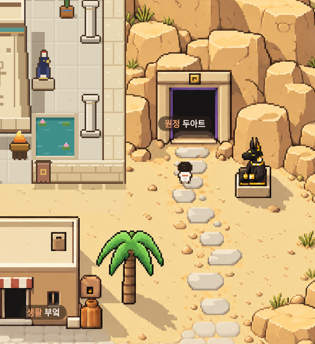
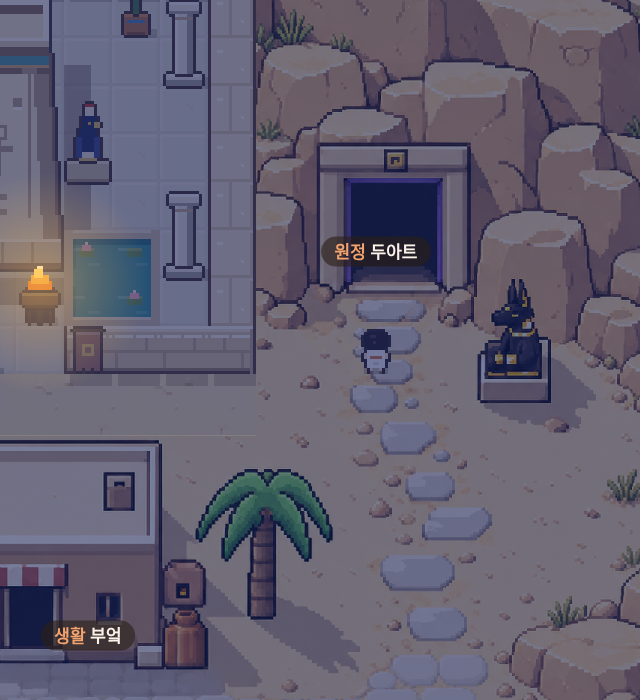
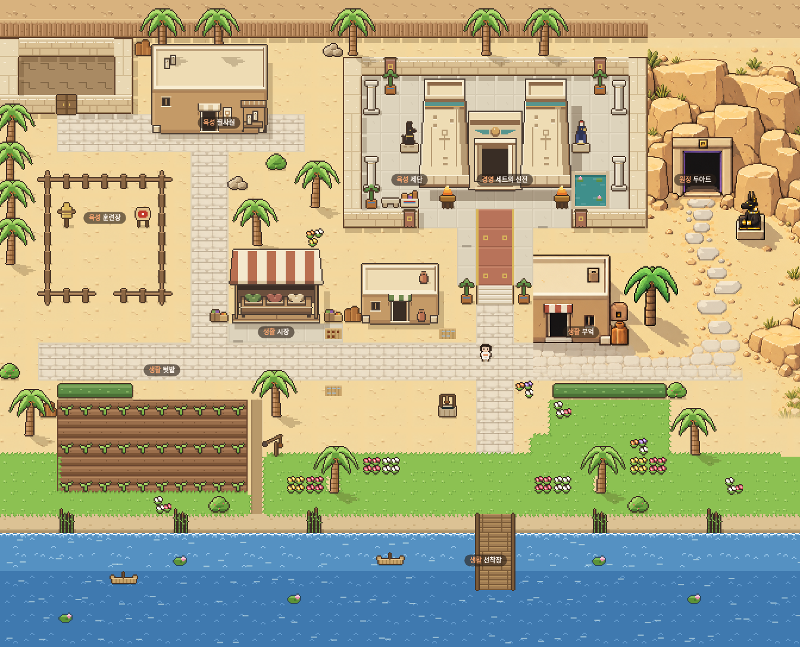

# 확정 시안 적용 · 0.8.12

사용자가 승인한 연결된 절벽 시안의 원본을 `data/art/duat-approved.png`로 복사해 직접 사용한다. 새 이미지 생성이나 반복 바위 조합은 사용하지 않는다.

- 절벽, 문, 아누비스, 징검돌은 원본의 상대 위치와 형태를 유지한다. 맵 폭에 맞게 오른쪽 부분은 잘린다.
- 부엌도 원본 그림으로 교체한다. 건물 오른쪽 그림자와 그 안의 화덕·항아리를 하나의 장면으로 유지한다. 기존 건물과 소품의 중복 그리기는 생략한다.
- 오아시스를 추가하지 않는다. 원본의 물 영역은 맵 경계 밖이며, 하단은 기존 마을 보도와 풀밭으로 전환한다. 기존 강과 강둑은 유지한다.
- 게임의 밤 조명을 원본에 적용한다. 별도 밤 그림을 생성하지 않았다.
- 문과 아누비스의 상호작용·충돌 위치를 새 그림에 맞췄다.

## 검증

실제 SillyTavern Chromium에서 이동·상호작용·복구 등 12개 항목 통과, 페이지 오류 없음. 9개 장소·3명 NPC·14개 모험 지점에 접근 가능하며 두아트 접근로 두 칸 왕복과 아누비스 뒤 통로를 확인했다.

낮·밤의 선택한 12개 내부 영역 184,050픽셀을 비교했다. 낮은 원본, 밤은 원본에 게임 조명을 적용한 기준과 차이 0이다. 특히 부엌 그림자와 화덕·항아리 영역을 포함한다. UI·캐릭터·경계 연결부는 비교에서 제외한다. 전체 화면이 원본과 동일하다는 뜻은 아니다. 캐릭터 앞뒤 가림과 캔버스 해제도 확인했다. 실제 휴대폰 하드웨어 테스트는 하지 않았다.

[실행 검증](consult/duat-approved/verification.json) · [영역 비교](consult/duat-approved/reference-comparison.json)
