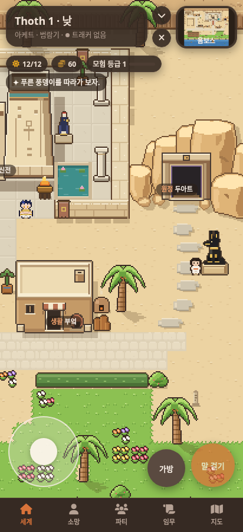
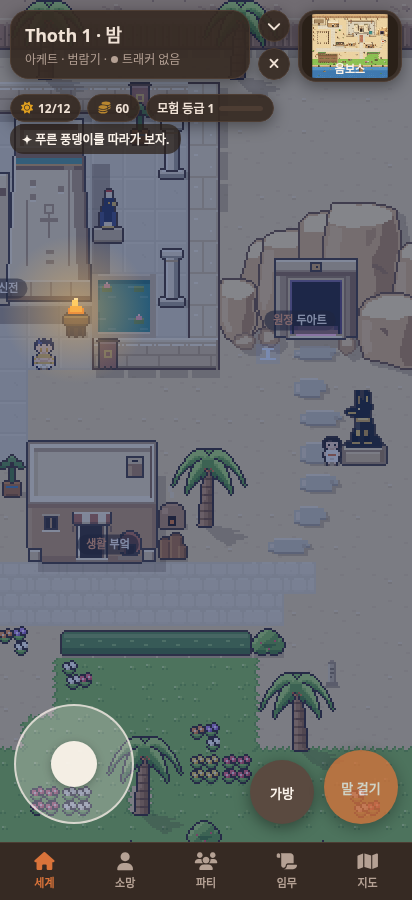

# 두아트 수호상 간격 보정

이 문서는 초기 간격 조정의 기록이다. 현재 변경은 [두아트 원본 시안 적용 · 0.8.10](DUAT-ORIGINAL.md)를 참고한다.

0.8.8의 사암 바위, 문틀, 앉은 아누비스 그림을 유지하고 수호상의 위치만 (38, 13)에서 (38, 14)로 한 칸 내렸다. 커진 수호상의 귀와 바위 사이에 여백이 생기고, 문에서 내려오는 길 옆으로 배치된다.

실제 SillyTavern 1.19.0에서 Chromium 412×900 화면으로 확인했다. [검사 결과](consult/duat-guardian-clearance/verification.json)는 11개 통과, 페이지 오류 0개다. 문 앞 두 줄 통로 왕복, 변경된 수호상 뒤 통과, 낮·밤 문 상호작용과 밤 벽화 발견을 포함한다. 실제 휴대전화 하드웨어 검사는 하지 않았다.

검사 스크립트는 수호상의 현재 좌표를 기준으로 뒤 통로를 확인한다. 새 테스트 프로필에서 숨겨진 캐릭터 템플릿을 누르지 않도록 실제 캐릭터와 채팅 로드를 기다리며, 키보드 검사 전에 채팅 입력칸의 포커스를 해제한다. 그림 생성기 두 종류의 일치 검사도 통과했다.
