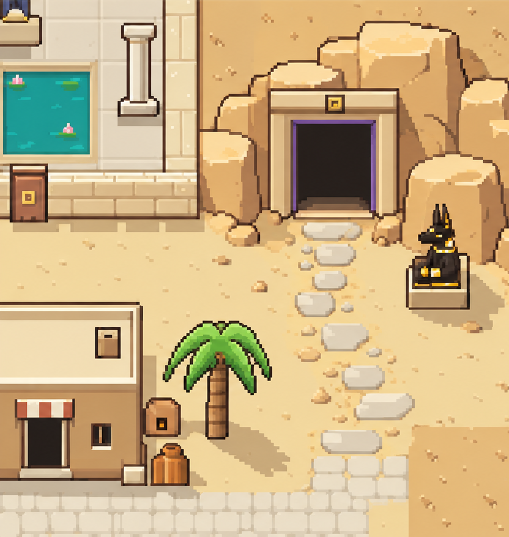
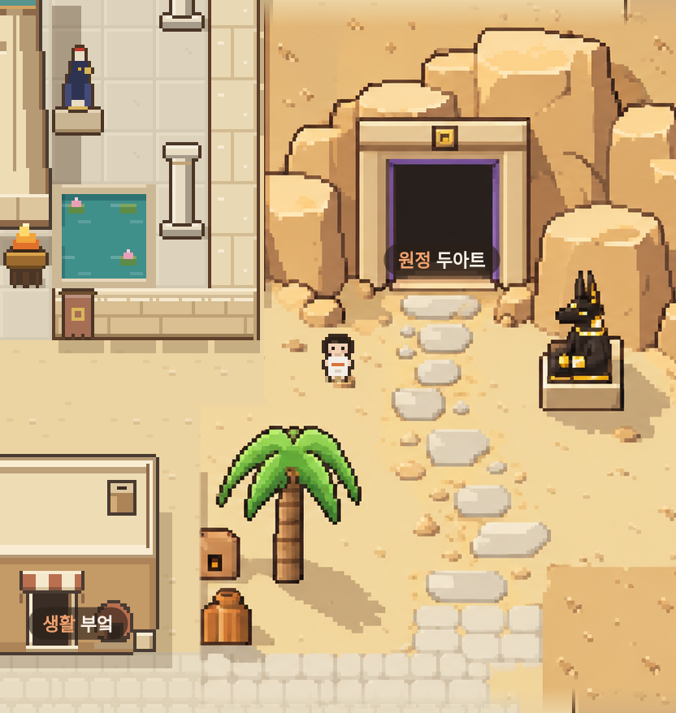
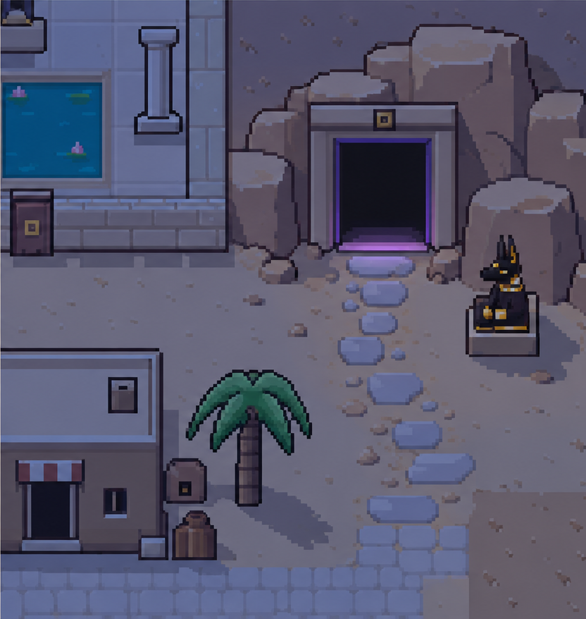
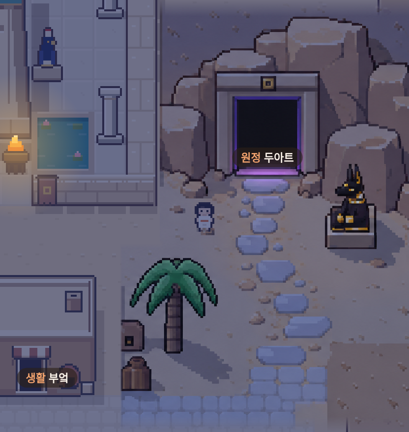

> 후속 연결부 수정과 최신 화면: [0.8.11 두아트와 마을 연결](DUAT-SEAMS.md). 아래는 0.8.10 기록이다.

# 두아트 원본 시안 적용 · 0.8.10

0.8.9에서 새로 생성한 바위와 수호상은 원본 시안과 색·형태가 달랐다. 해당 두 그림을 제거하고, 승인된 낮·밤 시안 PNG 자체를 지형 아틀라스로 사용한다. 절벽, 입구, 돌조각, 디딤돌, 모래, 수호상과 야자수의 그림자가 원본에서 함께 들어온다. 동쪽의 높은 지형 경계와 아래로 이어지는 절벽도 지도에 복구했다.

## 같은 크기로 대조

실제 화면은 게임 Renderer가 그린 결과이며 캐릭터와 장소 이름이 포함된다. 원본은 시안의 같은 부분이다. 주변 신전·집은 기존 게임 그림을 유지한다.

| 원본 낮 시안 | 실제 게임 낮 |
| --- | --- |
|  |  |

| 원본 밤 시안 | 실제 게임 밤 |
| --- | --- |
|  |  |

[실제 SillyTavern 모바일 낮](consult/duat-original/mobile-day.png) · [모바일 밤](consult/duat-original/mobile-night.png) · [전체 지도](consult/duat-original/map.png)

## 무엇이 일치하고, 무엇이 다른가

[픽셀 대조 결과](consult/duat-original/reference-comparison.json): 실제 Renderer를 원본 픽셀과 1:1인 배율로 실행하고, 절벽 윗면·왼쪽 바위·문 안쪽·수호상·디딤돌·야자수 그림자·포장 바닥·높은 지형의 낮/밤 16개 내부 영역을 비교했다. 총 116,940픽셀에서 RGBA 차이와 불일치 픽셀 수가 모두 0이다.

이 결과는 화면 전체의 100% 일치를 의미하지 않는다. 캐릭터·지명·주변 기존 건물과 지도 연결부는 비교에서 제외했다. 연결부 네 곳에만 짧은 투명도 전환을 사용한다. 나머지 원본 내부의 색을 보정하거나 다시 그리지 않는다. 모바일 배율에서는 원본 픽셀을 가장 가까운 픽셀 방식으로 축소하므로 원본 크기 화면과 보이는 세밀함이 다를 수 있다.

`data/art/duat-reference.png`는 제공된 고해상도 원본 PNG와 바이트 단위로 동일하다. SHA-256:

```
8594cf79c309270277ba164b99da5529ebe0ba89e97580cf6cbbb846d8463dec
```

## 실제 게임 동작

옴보스는 42×34칸이다. 0.8.9에서 불필요하게 넓혔던 동쪽 두 칸을 줄이고, 높은 지형의 경계를 신전 옆 입구부터 남쪽으로 배치했다. 길과 문, 수호상·야자수·화덕·항아리의 충돌 위치를 원본 배치에 맞췄다. 기존 저장 위치가 새 지도에서 막혀 있으면 기존 위치 복구 규칙에 따라 마을 시작점으로 이동한다.

배경 위에 캐릭터·동료·사건을 매 프레임 그린다. 바위·수호상·야자수의 윤곽과 발밑 깊이로 가림을 처리한다. 빈 모래까지 덮는 사각형 가림을 쓰지 않는다. 밤에는 시안의 밤 패널을 직접 사용해 밤 보정을 두 번 적용하지 않는다. 주변 지형과의 색 차이를 줄이기 위해 공통 밤 조명을 조금 어둡게 조정했으며 이 조명은 다른 지역에도 적용된다.

`data/scene-art.json`에 원본 영역·지도 위치·가림 윤곽·연결부를 기록한다. 원본은 최초 한 번 디코딩하며, 낮/밤 패널은 캐시한다. 이동 중 다운로드하지 않고, 창을 접으면 추가 캐릭터 캔버스도 해제한다.

## 검증

[실제 SillyTavern 브라우저 검사](consult/duat-original/verification.json) 12개 통과, 페이지 오류 0개. 두 줄 길 왕복, 수호상 뒤 통행, 낮·밤 문과 밤 벽화 상호작용, 모든 장소 접근, 키보드·터치 입력, 정비·화면 복구를 포함한다.

별도 원본 대조 검사에서 16개 영역의 픽셀 일치, 수호상 뒤/앞의 캐릭터 가림, 빈 모래 위 캐릭터 표시, 캔버스 해제를 확인했다. 모바일 크기 Chromium 검사이며 실제 휴대전화 하드웨어 검사는 하지 않았다.

```sh
node tools/art/verify-browser.cjs /tmp/duat-original
node tools/art/verify-reference.cjs /tmp/duat-original
node tools/art/capture-browser.cjs original /tmp/duat-original
```
