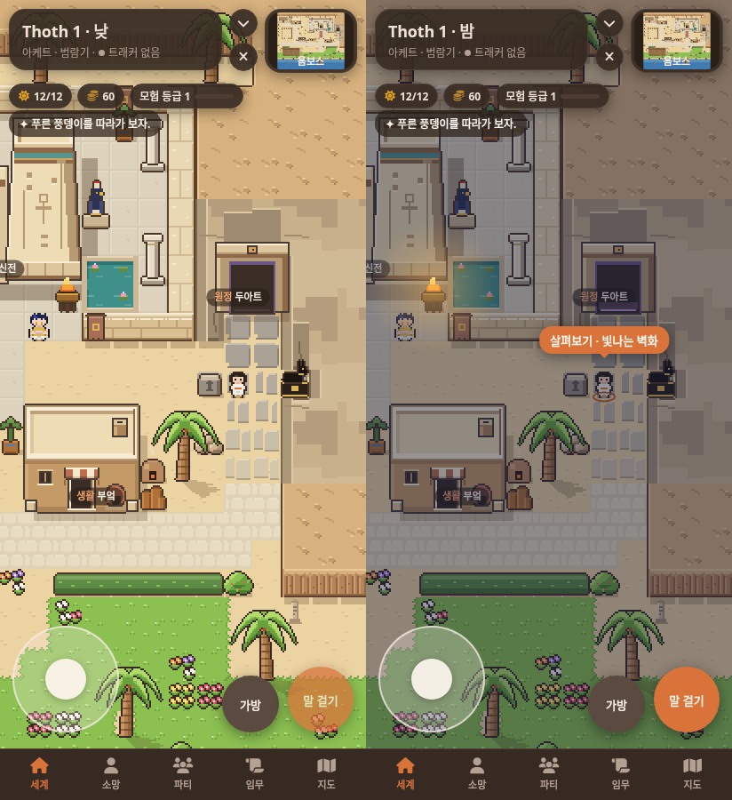
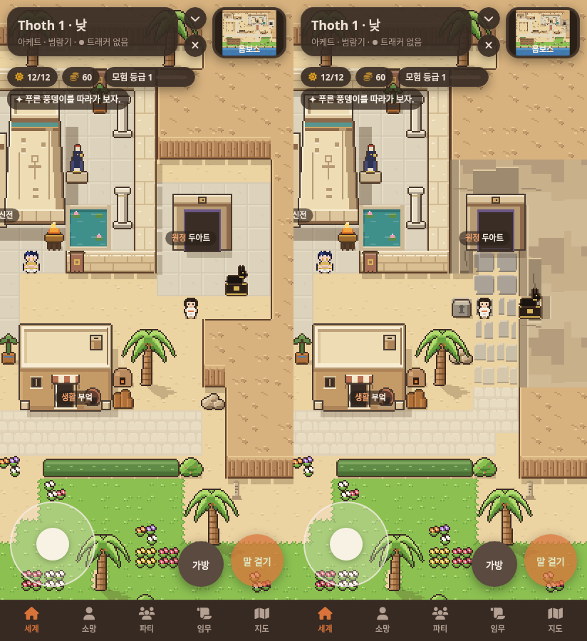

# 두아트 · 봉인된 절벽 통로 · 0.8.6

밝은 사각 마당 대신 부엌 옆 마을 길에서 이어지는 좁은 돌길과 암벽 입구를 만들었어.
기존 문 그림과 건물 점유 영역, 상호작용 위치는 유지했어.

## 낮과 밤

실제 SillyTavern에서 같은 위치의 412×900 화면을 촬영했어. 왼쪽은 낮, 오른쪽은 밤이야.



마을 쪽 돌길은 기존 밝은 포장으로 시작하고, 문에 가까워질수록 회갈색 돌 사이에 모래가 드러나.
실제 통행 폭은 두 칸이야. 오른쪽의 기존 바위 지형과 문 뒤·양옆 암벽을 지도 타일로 이어서 문이 암벽 입구에 놓이도록 했어.
큰 암벽 면은 여러 타일에 걸쳐 그리며, 실제로 막히는 바위 타일 안에서만 표시해.
그리기 순서로 기존 지형 경계를 덮는 방식이 아니야.

검은 자칼 상은 길목 오른쪽으로 옮기고 반대편에 작은 봉인석을 놓았어.
문 안쪽은 낮에도 어둡고 밤에는 안쪽 하단과 문턱에만 보랏빛이 조금 더 보여.
주변 마을에 별도의 어두운 효과는 추가하지 않았어. 밤 화면의 주황 안내는 기존 밤 발견 기능이야.

## 수정 전후

왼쪽은 0.8.5, 오른쪽은 0.8.6이야.



[수정 후 전체 지도](consult/duat-passage/after-map.png)는 실제 게임 Renderer로 그린 검토용 화면이야.
다른 건물, 야자수 모양, 잔디와 물결 그림, 채워 둔 텃밭은 유지했어.

## 검증

[브라우저 검사 11개 통과, 페이지 오류 0개](consult/duat-passage/verification.json).

- 돌길 양쪽 줄을 실제 플레이어 이동·충돌 코드로 각각 문 앞까지 왕복했어.
- 문, 자칼 상과 봉인석은 막히고 두 칸 폭의 통로는 비어 있어.
- 낮의 닫힌 문 안내와 밤의 원정 준비 화면을 실제 말 걸기 버튼으로 확인했어.
- 정비 전후 장소 9개, NPC 3명, 모험 기준점 14개에 모두 접근할 수 있어.
- 키보드·터치 이동, 다른 장소와 NPC 카드, 정비 오버레이, 야간 발견, 지붕 가림과 화면 복구 검사가 통과했어.

새 암벽과 겹치던 `behind_temple` 모험 기준점은 같은 신전 동쪽의 걸을 수 있는 자리로 옮겼어.
지도 좌표는 34,8에서 34,12로 바뀌었어. 장소와 NPC 좌표, 정비 오버레이는 그대로야.
문을 포함한 모든 기존 그림 데이터는 바꾸지 않았고 `buildings.py --check`가 통과했어.
실제 휴대전화 하드웨어 검사는 하지 않았어.

```sh
python3 tools/art/buildings.py --check data/tiles.json
node tools/art/verify-browser.cjs /tmp/duat-review
node tools/art/capture-browser.cjs after /tmp/duat-review
```

촬영 도구에 두아트 밤 장면을 추가하고, 촬영 뒤 임시 게임 상태를 복원하도록 했어.
