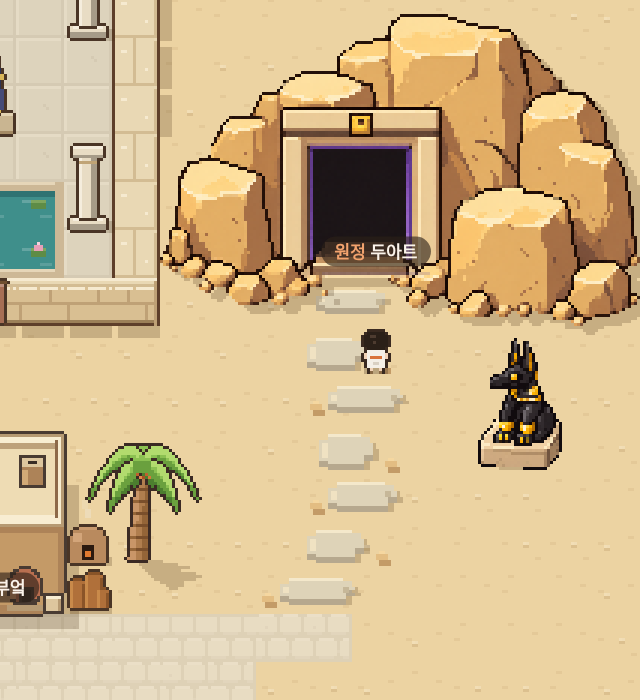
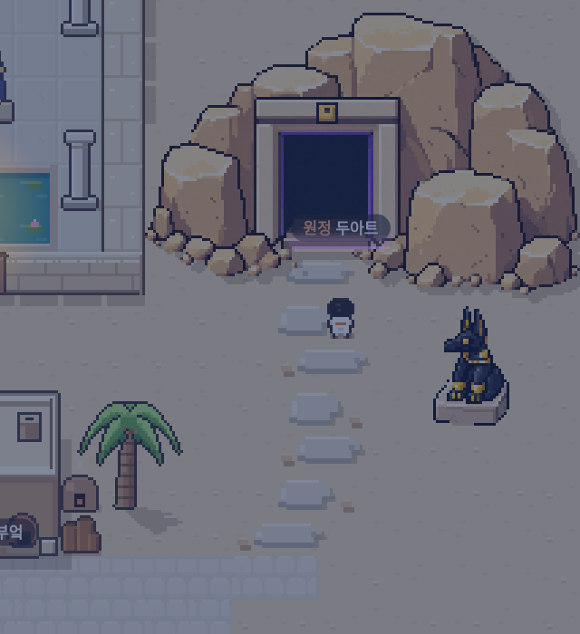

# 두아트 절벽과 입구 교체 · 0.8.9

기존 구현은 작은 도형으로 바위를 그리면서 시안의 높은 뒷절벽, 겹친 바위, 두꺼운 문틀과 표면 명암을 잃었다. 이번에는 제공된 낮·밤 시안을 참고해 절벽과 입구가 붙어 있는 투명 PNG를 제작하고, 실제 게임의 두아트 그림으로 교체했다. 앉은 아누비스상도 새 PNG를 사용한다.

## 실제 게임 렌더러 확대 화면

아래 화면은 생성형 시안이 아니라 저장소의 Renderer를 3배 배율로 실행한 결과다. 지명과 캐릭터도 실제 렌더러가 그린다. 원본 시안과 픽셀 단위로 동일한 복제는 아니며, 지도 배치와 카메라 구도에도 차이가 있다.

| 낮 | 밤 |
| --- | --- |
|  |  |

[실제 SillyTavern 모바일 화면 · 낮](consult/duat-rebuild/mobile-day.png) · [밤](consult/duat-rebuild/mobile-night.png) · [전체 지도](consult/duat-rebuild/map.png)

## 배치와 동작

오른쪽 바위가 지도 끝에 잘리지 않도록 옴보스를 40×34에서 44×34칸으로 확장했다. 기존 마을의 건물 좌표는 유지하고 동쪽 공간, 강과 강둑의 끝을 연장했다. 두아트 문은 새 그림의 입구에 맞춰 충돌 영역과 상호작용 위치를 옮겼다. 아누비스상은 길 오른쪽 (41, 14)에 서고, 뒤와 왼쪽에 통행 공간이 있다. 크기와 간격이 다른 디딤돌과 작은 사암 조각이 마을 길에서 문까지 이어진다.

## 자산 관리

- `data/art/duat-entrance.png`: 절벽과 문이 결합된 그림 원본.
- `data/art/duat-guardian.png`: 수호상과 밝은 돌 받침 그림 원본.
- `data/scene-art.json`: 원본에서 사용할 영역과 게임 안의 크기. 절벽은 160×104, 수호상은 28×44 게임 픽셀.
- `loadData()`가 두 그림을 최초 한 번 읽고 작은 캔버스로 변환한다. 가장 가까운 픽셀을 사용하고 반투명 테두리를 제거해 게임의 선명한 윤곽을 유지한다. 걷는 동안 다시 다운로드하지 않는다.
- `artInLandform`인 문은 절벽 그림에 이미 포함돼 있으므로 이전 문 그림과 직사각형 그림자를 중복 출력하지 않는다. 충돌과 상호작용은 기존 건물/장소 시스템을 사용한다.
- `tools/art/duat.py`는 이전 JSON 그림의 재생성용이다. 현행 두아트 PNG를 생성하거나 덮어쓰는 도구가 아니다.

## 검증

[실제 SillyTavern 1.19.0 브라우저 검사 결과](consult/duat-rebuild/verification.json): 12개 통과, 페이지 오류 0개. 그림 디코딩과 투명 배경, 키보드·터치 이동, 문 앞 두 줄 길 왕복, 수호상 뒤 통행, 낮·밤 문과 벽화 상호작용, 정비 전후 장소 접근, 지붕 가림, 화면 복구와 이동 중 재다운로드 여부를 확인했다.

JS 구문 검사와 기존 건물/타일 그림 생성기 일치 검사도 통과했다. 모바일 크기의 Chromium으로 확인했으며 실제 휴대전화 하드웨어 검사는 하지 않았다.

```sh
node tools/art/verify-browser.cjs /tmp/duat-rebuild
node tools/art/capture-browser.cjs rebuild /tmp/duat-rebuild
```
