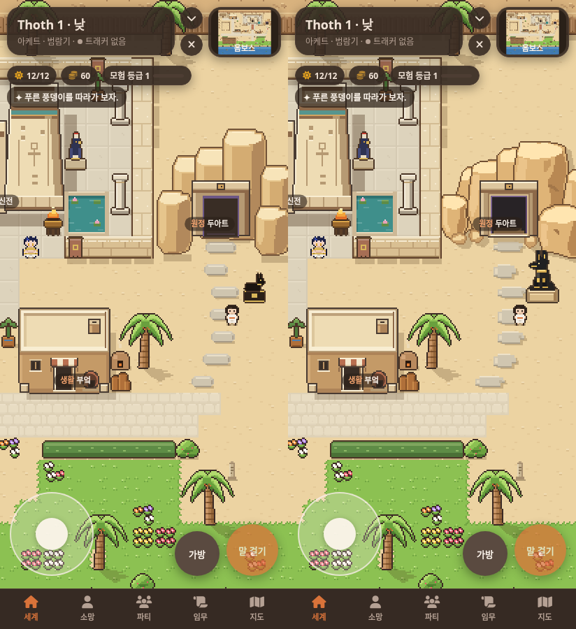
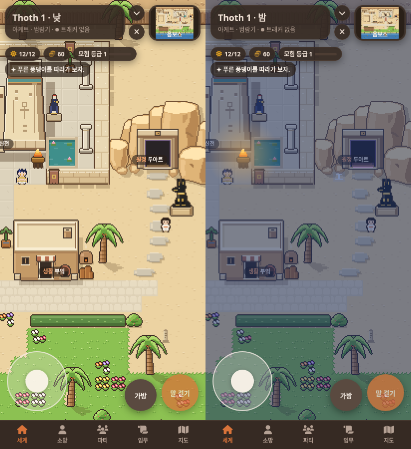

# 두아트 시안 보정 · 0.8.8

0.8.7은 바위마다 같은 단면을 반복해서 기둥처럼 보였고, 기존 작은 누운 자칼 상을 사용해 시안의 형태와 달랐어.
이번에는 시안의 개별 윤곽과 겹치는 순서를 기준으로 다시 그렸어.

## 실제 화면 전후

왼쪽은 0.8.7, 오른쪽은 0.8.8이야. 같은 위치에서 실제 SillyTavern을 412×900 크기로 촬영했어.



바위 윗면을 넓히고 좌우 면을 기울였어. 밑동 높이와 바위 폭도 서로 다르게 맞췄어.
오른쪽 앞의 넓은 바위, 왼쪽의 작은 바위, 뒤의 높은 바위를 겹쳤고 밑에는 몇 개의 큰 돌조각만 놓았어.
바위 그림자는 새 윤곽을 따라가도록 바꿨어.

문의 기존 직사각형 외곽 크기는 유지하면서 안쪽을 더 어둡게 하고 문틀의 두께와 안으로 들어가는 짧은 계단을 추가했어.
수호상은 귀가 선 앉은 아누비스 형태, 금색 장식, 밝은 사암 받침으로 새로 만들었어.
디딤돌은 길이와 두께, 깨진 모서리를 달리했어.

## 낮과 밤



밤 전체 조명의 갈색 기운을 줄이고 청회색으로 조정했어. 이 조명 변경은 다른 지역의 밤에도 적용돼.
입구 안쪽과 문턱의 작은 보랏빛은 유지했어.
시안과 게임은 픽셀 크기와 화면 구도가 다르고, 실제 게임에는 장소 이름과 UI가 표시돼.

[전체 지도](consult/duat-reference-correction/after-map.png)

## 검증

[브라우저 검사 11개 통과, 페이지 오류 0개](consult/duat-reference-correction/verification.json).
문 앞 두 줄 통로 왕복, 조각상 뒤 통과, 낮·밤 문 상호작용, 밤 벽화 발견을 확인했어.
정비 전후 모든 장소·NPC·모험 기준점에 접근할 수 있어.
기존 이동·터치·정비·지붕 가림·화면 복구 검사도 통과했어.

지도 배치와 충돌 데이터는 0.8.7과 같아.
기존 그림에서는 두아트 문과 암벽만 변경했고, 앉은 수호상 그림을 추가했어.
집·시장·신전·야자수·잔디·물결과 낮의 공통 팔레트는 유지했어.
두 제작 도구 검사와 전체 타일 재생성이 배포 데이터와 일치해.
실제 휴대전화 하드웨어 검사는 하지 않았어.

```sh
python3 tools/art/duat.py --check data/tiles.json
python3 tools/art/buildings.py --check data/tiles.json
node tools/art/verify-browser.cjs /tmp/duat-review
node tools/art/capture-browser.cjs after /tmp/duat-review
```
