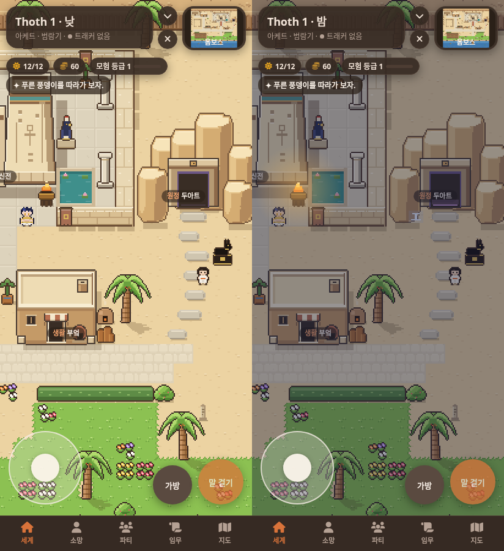

# 밝은 사암 속 두아트 · 0.8.7

첨부된 낮·밤 시안의 실루엣과 색을 게임의 기존 픽셀 크기로 옮겼어.
반듯한 절벽 타일 대신 높낮이가 다른 여섯 바위 덩어리로 입구를 감쌌어.
밝은 윗면, 황토색 앞면, 오른쪽 그늘로 두께를 보여 주고 잔무늬는 줄였어.

## 실제 낮·밤 화면

왼쪽은 낮, 오른쪽은 밤이야. 실제 SillyTavern을 412×900 크기로 열어 캐릭터와 함께 촬영했어.



마을 포장에서 이어지는 길은 모래 사이로 놓인 넓은 디딤돌이야.
돌을 조금씩 엇갈리게 놓았고 사이 모래도 걸을 수 있어.
작은 봉인석은 없애고 검은 조각상은 입구 오른쪽에 놓았어.
바위 밑과 조각상 사이에는 캐릭터가 지날 수 있는 한 칸 폭의 빈자리가 있어.

기존 문 그림은 그대로야. 양옆 바위 공간을 확보하려고 문과 상호작용 지점을 한 칸 오른쪽으로 옮겼어.
밤에는 기존 밤 조명을 따르며 문 안쪽과 문턱만 보랏빛으로 드러나.
기존 밤 발견인 ‘빛나는 벽화’는 빈 바닥에서 왼쪽 바위 면으로 옮겨 발견 기능을 유지했어.

## 이전 화면과 전체 지도

[0.8.6 낮 화면](consult/duat-sandstone/before-duat.png) · [수정 후 전체 지도](consult/duat-sandstone/after-map.png)

전체 지도는 같은 게임 Renderer로 그린 검토용 화면이야.
다른 건물과 야자수 그림, 잔디 경계, 하얀 물결, 채워 둔 텃밭은 유지했어.

## 제작과 검증

`tools/art/duat.py`에서 96×96픽셀 바위 자산을 생성해 `data/tiles.json`에 넣었어.
지도 `landforms`가 배치와 기준점을 정하고, 바위 지형 타일이 충돌을 정해.
뒤쪽으로 솟은 그림은 기존 위 레이어에 놓여 캐릭터를 가려.
모든 기존 그림 데이터는 그대로이고 새 바위 자산 하나만 추가됐어.

[브라우저 검사 11개 통과, 페이지 오류 0개](consult/duat-sandstone/verification.json).

- 문 앞 두 줄 통로를 실제 이동 코드로 왕복했어.
- 조각상 뒤를 왼쪽에서 오른쪽으로 걸어서 통과했어.
- 옮긴 문은 낮 안내와 밤 원정 준비 화면이 정상으로 열려.
- 옮긴 밤 벽화 발견도 실제 말 걸기 버튼으로 확인했어.
- 정비 전후 모든 장소 9개, NPC 3명, 모험 기준점 14개에 접근할 수 있어.
- 기존 이동·터치·상호작용·정비·지붕 가림·화면 복구 검사도 통과했어.

문은 35,9에서 36,9로, 문 상호작용은 35,11에서 36,11로 이동했어.
조각상은 38,13에 있으며 뒤쪽 38,12가 비어 있어.
밤 벽화는 35,13에서 35,11로 옮겼어.
실제 휴대전화 하드웨어 검사는 하지 않았어.

건물과 바위 생성기 검사, `tiles.py` 전체 재생성이 배포 데이터와 일치해.

```sh
python3 tools/art/duat.py --check data/tiles.json
python3 tools/art/buildings.py --check data/tiles.json
node tools/art/verify-browser.cjs /tmp/duat-sandstone-review
node tools/art/capture-browser.cjs after /tmp/duat-sandstone-review
```
