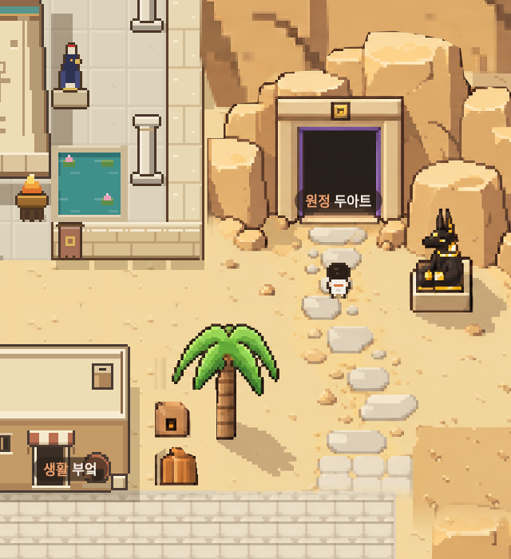
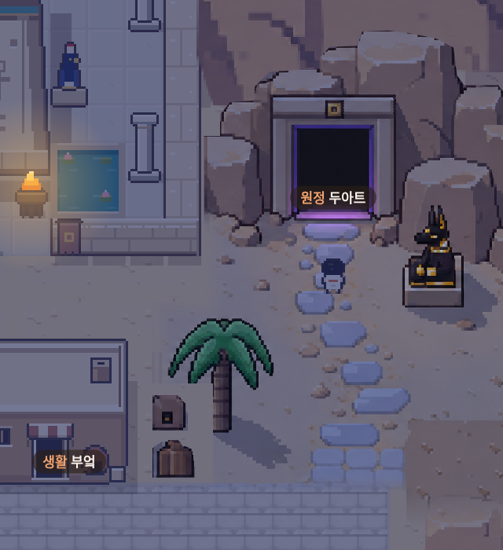
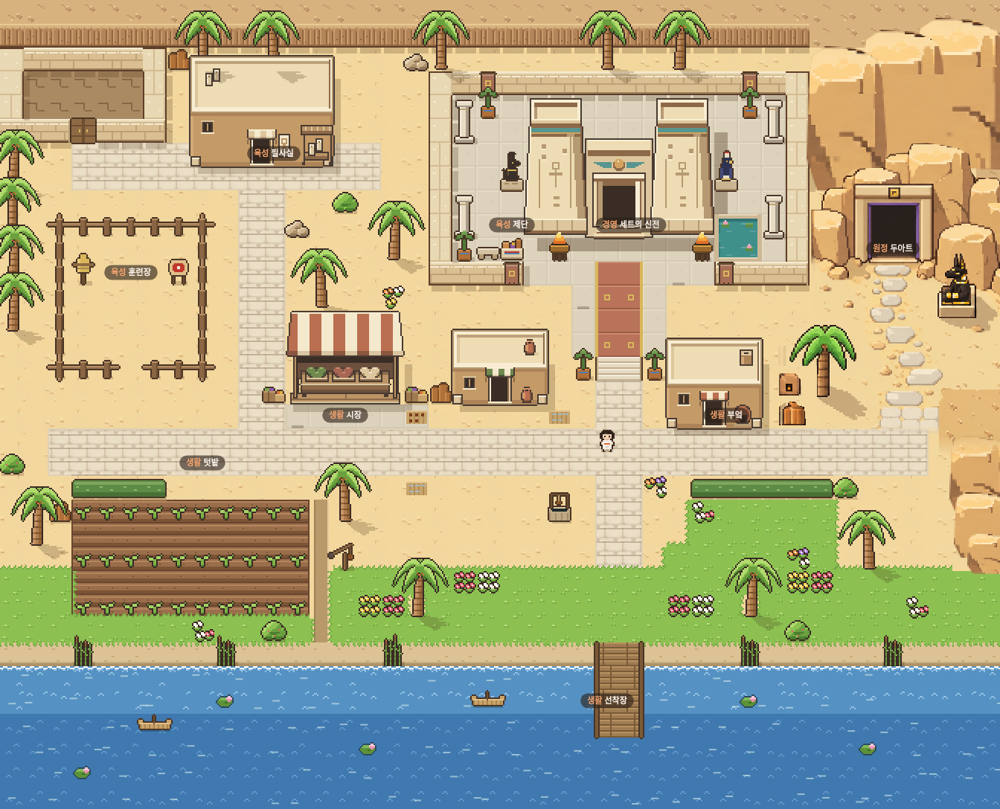

> 이 안은 교체됨. 최신: [확정 시안 적용 · 0.8.12](DUAT-APPROVED.md).

# 두아트와 마을 연결 · 0.8.11

원본 시안의 입구를 유지하면서 주변 맵과 연결했다. 새 이미지 생성 없이 기존 `data/art/duat-reference.png`에서 모래, 포장석, 바위 면을 재사용한다. 원본 PNG 자체는 변경하지 않았다.

- 옴보스 전체 모래와 보도에 원본에서 가져온 재료를 사용한다. 모래 조각의 가장자리를 같은 바탕색으로 맞춰 반복 사각형을 줄인다.
- 부엌 위치와 맞지 않던 원본 속 집 그림자를 제거한다. 실제 건물의 그림자는 기존 맵에서 그리며, 화덕·항아리·야자수는 남긴다.
- 원본 보도 하단을 실제 맵 보도로 전환해 겹친 포장선과 잘린 연결부를 줄인다.
- 신전 동쪽 위 빈 부분에 높이가 다른 사암 면을 이어 붙인다. 아래쪽 절벽은 강가를 향해 좁아지도록 연결한다.
- 위쪽·아래쪽 바위에 충돌을 적용하면서 두아트 접근로 두 칸과 아누비스 뒤 통로는 유지한다.

## 실제 게임 화면

## 확인

실제 SillyTavern의 Chromium 모바일 화면에서 12개 검증 항목 통과, 페이지 오류 없음. 방향키·터치 이동, 두아트 왕복, 모든 장소·NPC·모험 지점 접근, 낮·밤 상호작용, 접기·다시 열기와 화면 복구를 확인했다.

원본을 유지하는 낮·밤 14개 영역 105,120픽셀에서 원본과 차이 0. 마을 보도는 이번에 교체했으므로 원본 동일성 검사에서 제외했고, 야자수 그림자 검사는 새 보도 연결부 전까지로 한정했다. 캐릭터 가림과 캔버스 해제 검사도 통과했다. 변경된 연결부는 위 게임 화면으로 검토한다. 전체 화면이 원본과 동일하다는 의미는 아니다. 실제 휴대폰 기기에서의 검증은 하지 않았다.

- [실행 검증](consult/duat-seams/verification.json)
- [원본 유지 영역 비교](consult/duat-seams/reference-comparison.json)
