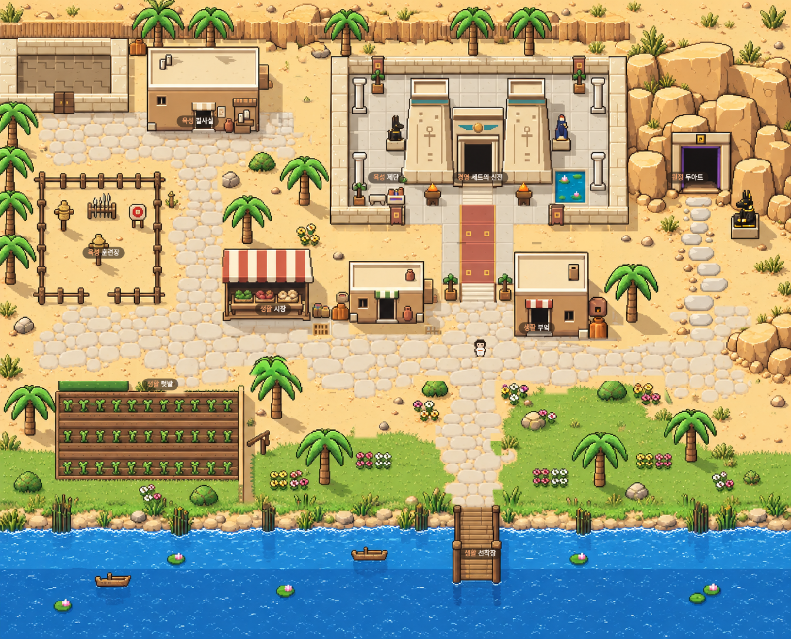
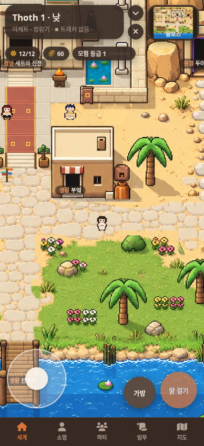
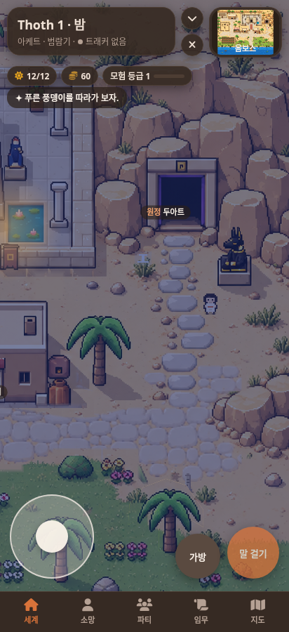

# 옴보스 전체 시안 적용 · 0.8.13

채택한 넓은 도보 2번 시안(`docs/consult/wide-road-options/road-only-2.png`)을 `data/art/ombos-approved.png`로 복사해 전체 맵 배경으로 사용한다. 두 파일의 SHA-256이 같으며 이번 게임 적용에는 새 이미지 생성이나 재그리기가 없다.

- 건물, 도보, 절벽, 두아트, 식생, 물가와 그림자를 원본 이미지에서 함께 그린다. 기존 정적 건물과 장식은 중복해서 그리지 않는다.
- 전체 1392×1130 이미지를 기존 42×34 게임 좌표에 맞춰 표시한다. 이미지 가장자리는 자르지 않는다. 본 화면과 미니맵 모두 같은 원본을 사용한다.
- 캐릭터·NPC·이벤트 오브젝트·상호작용 표시는 게임에서 계속 그린다. 건물과 야자수 뒤에서는 원본의 앞부분을 다시 그려 캐릭터를 가린다.
- 충돌은 원본 그림에 맞춘 발밑 다각형으로 판정한다. 이전 타일의 숨은 벽을 제거하고 건물, 문, 물, 선착장, 울타리, 나무와 소품 위치에 맞춘다.
- 부엌·시장·필사실·신전·선착장 등의 상호작용을 새 배치에 맞춘다. 기존 저장 위치가 새 건물 내부라면 안전한 시작 지점으로 복구한다.
- 낮 배경은 원본, 밤은 같은 원본에 기존 밤 조명을 적용한다. 계절에 따른 기본 배경/식생 색은 선택 시안으로 고정된다. 수로·밭·정원 정비 결과와 수리한 배는 기존 게임 상태에 따라 반영한다.

## 실제 게임 화면

## 검증

실제 SillyTavern에서 Chromium의 412×900 터치 화면으로 12개 검증 항목을 통과했다. 페이지 오류는 없다. 실제 휴대폰 하드웨어에서는 검증하지 않았다.

- UI·인물·시간 효과를 분리한 배경 전체를 원본과 같은 크기로 렌더링해 비교: 낮 1,462,272픽셀, 밤 1,462,272픽셀 모두 차이 0. 밤의 기준은 원본에 게임 밤 틴트를 적용한 이미지다.
- 캐릭터 발 크기를 포함한 이동 탐색: 정비 전후 모든 장소, NPC, 모험 지점, 비밀과 오벨리스크에 접근 가능.
- 실제 키보드와 터치 이동, 부엌 벽 충돌, 두아트 왕복, 선착장 끝 물 충돌, 7종 장소/NPC 카드와 두아트 낮·밤 카드 확인.
- 건물 뒤/앞 인물 가림, 수로·밭 정비와 배, 옛 저장 위치 복구, 창 접기/다시 열기와 캔버스 복구 확인.

실행: `node tools/art/verify-full-map.cjs /tmp/approved-full-map` (로컬 SillyTavern 8000 포트, Playwright/Chromium 필요)

[검증 결과](consult/ombos-approved/verification.json)
