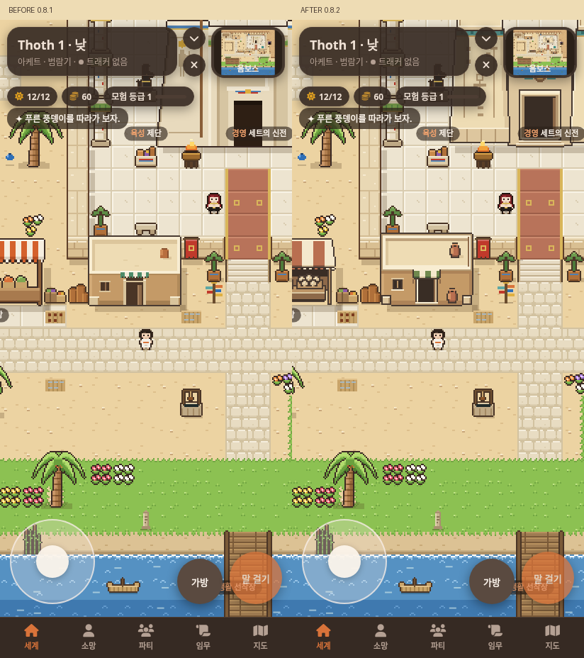
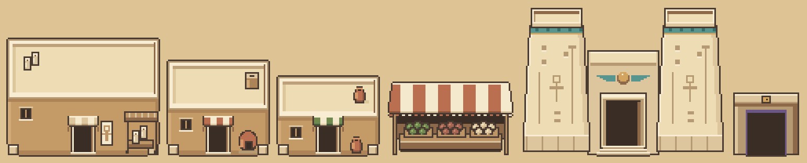

# 옴보스 건물 · 0.8.2

첨부된 OMBOS BUILDING STUDY를 실제 게임의 글자 격자 그림으로 옮겼어.
집 하나를 먼저 실제 화면으로 확인한 뒤 같은 기준으로 나머지를 완성했어.

## 수정 전후

같은 위치, 같은 412×900 모바일 화면이야. 왼쪽은 0.8.1, 오른쪽은 0.8.2야.
두 스크린샷은 크기나 색을 바꾸지 않고 나란히 놓았어.



- [집을 먼저 적용한 중간 화면](consult/ombos-buildings/house-first-house.png)
- [시장](consult/ombos-buildings/after-market.png) · [필사실](consult/ombos-buildings/after-scribe.png) · [부엌](consult/ombos-buildings/after-kitchen.png)
- [신전 낮](consult/ombos-buildings/after-temple.png) · [신전 밤](consult/ombos-buildings/after-temple-night.png) · [집 밤](consult/ombos-buildings/after-house-night.png)
- [지도 전체 수정 전](consult/ombos-buildings/before-map.png) · [지도 전체 수정 후](consult/ombos-buildings/after-map.png)

지도 전체 이미지는 실제 SillyTavern에서 로드한 맵을 게임의 Renderer로 그린 검토용 화면이야. 모바일 UI 캡처와 구분해서 담았어.

## 달라진 그림

- 집·필사실·부엌: 수직 벽과 밝은 평지붕, 얇은 난간, 공통 크기의 출입구. 차양 아래 그늘과 밝은 문턱으로 깊이를 줬어.
- 필사실: 작은 작업 차양, 두루마리, 간결한 표식. 부엌: 낮은 환기구와 둥근 화덕.
- 신전: 높은 양쪽 탑과 낮은 중앙 문, 청록색 띠, 날개 달린 해, 간결한 부조와 계단.
- 시장: 크림·적갈색 천막의 넓은 윗면, 짧은 앞단, 그늘 아래 세 상품 바구니.
- 두아트 문: 기존 네모 실루엣과 보랏빛 안쪽을 유지하고 돌 재료색과 외곽선을 맞췄어.



야자수, 잔디와 강가 경계, 물결, 땅 타일, 계절색, 작물과 다른 소품 데이터는 이전과 같아.
맵의 건물 자리·충돌·장소·NPC·모험 지점과 렌더링 코드는 수정하지 않았어.
지붕이 건물 점유 영역 위로 올라가는 기존 두 레이어 구조를 그대로 사용해.

| 그림 | 점유 영역 | 그림 크기 |
|---|---|---|
| 집 | 4×2타일 | 66×52픽셀 |
| 필사실 | 6×4타일 | 98×76픽셀 |
| 부엌 | 4×3타일 | 66×62픽셀 |
| 시장 | 5×2타일 | 82×48픽셀 |
| 신전 | 8×5타일 | 130×96픽셀 |
| 두아트 문 | 2×2타일 | 44×42픽셀 |

그림 크기는 1픽셀 외곽선을 포함해. 일반 건물의 문 안쪽은 12×17픽셀이야.

## 제작과 재생성

`tools/art/house5.py`가 일반 건물의 재료색·난간·문·차양을 공유하고,
`tools/art/buildings.py`가 여섯 건물을 구성해. 게임에 배포되는 그림은 `data/tiles.json`이야.

저장소 루트에서 Python과 Pillow로 실행해. 게임을 사용하는 폰에는 Python이나 Pillow를 설치할 필요가 없어.

```sh
python3 tools/art/buildings.py --write data/tiles.json
python3 tools/art/buildings.py --check data/tiles.json
python3 tools/art/buildings.py --preview /tmp/ombos-buildings-3x.png
```

`--write`는 건물 여섯 항목만 갱신하고 다른 타일과 소품을 보존해.
`--check`는 원본 도구와 배포 데이터가 달라지면 실패해.
기존 `tiles.py` 전체 생성도 같은 건물 제작 경로를 사용해. 임시 폴더에서 실행해 만들어진
`tiles_out.json`의 colors·seasons·tiles·things가 배포 데이터와 모두 일치하는 것을 확인했어.

## 실제 환경 검증

SillyTavern 1.19.0, Chromium, Playwright에서 412×900 터치 화면으로 확인했어.
준비된 전용 테스트 호스트에서 다음 명령으로 다시 검사할 수 있어.
호스트가 기본 예제 캐릭터를 포함하고 확장 폴더를 `SandAndFeather`로 연결한 상태여야 해.
Playwright 모듈과 `/usr/bin/chromium`은 준비된 클라우드 환경의 도구를 사용해.

```sh
node tools/art/verify-browser.cjs /tmp/ombos-review
node tools/art/capture-browser.cjs after /tmp/ombos-review
```

검증 스크립트는 예제 채팅에 임시 게임 상태를 넣고 종료할 때 기존 게임 상태를 복원해.
화면 캡처 스크립트는 해당 개발용 채팅에서 카메라를 지정된 위치로 이동해.

[검증 결과 원본](consult/ombos-buildings/verification.json)의 10개 항목이 통과했어.

- 여섯 건물 격자와 확장 데이터 로딩
- 키보드 이동과 집 벽 충돌
- 터치 패드 이동
- 시장·부엌·필사실·신전·세트 상호작용 카드
- 정비 전후 장소 9개, NPC 3명, 모험 기준점 14개 접근 가능
- 수로·밭 정비 완료와 배 등장
- 야간 조명과 밤에만 보이는 벽화
- 집 지붕 뒤 캐릭터 가림
- 접을 때 캔버스 해제, 다시 열기와 탭 복귀·컨텍스트 복구 이벤트 뒤 다시 그리기
- 이동 중 아트 재요청 없음

마지막 실행의 브라우저 오류는 0개야. 초기 실행에서는 호스트의 기본 AI Horde 연결이
제한된 네트워크에서 실패했어. 전용 테스트 호스트의 AI 연결 선택을 사용하지 않는 로컬
Kobold 연결로 바꾼 뒤 다시 통과했어. 그래픽 검사에 AI 호출은 필요하지 않아.

탭 복귀와 컨텍스트 복구는 브라우저 이벤트를 발생시켜 검사했어.
실제 안드로이드 기기의 메모리 압박이나 외부 AI 생성은 이번 검증 범위에 포함하지 않았어.

## 업데이트

이 변경이 기본 브랜치에 반영되면 SillyTavern의 확장 업데이트 후 화면을 새로고침하면 돼.
병합 전에는 작업 브랜치 `art/ombos-building-study`를 별도 테스트 설치에서 사용할 수 있어.
저장 데이터의 버전이나 형식은 바뀌지 않아.
