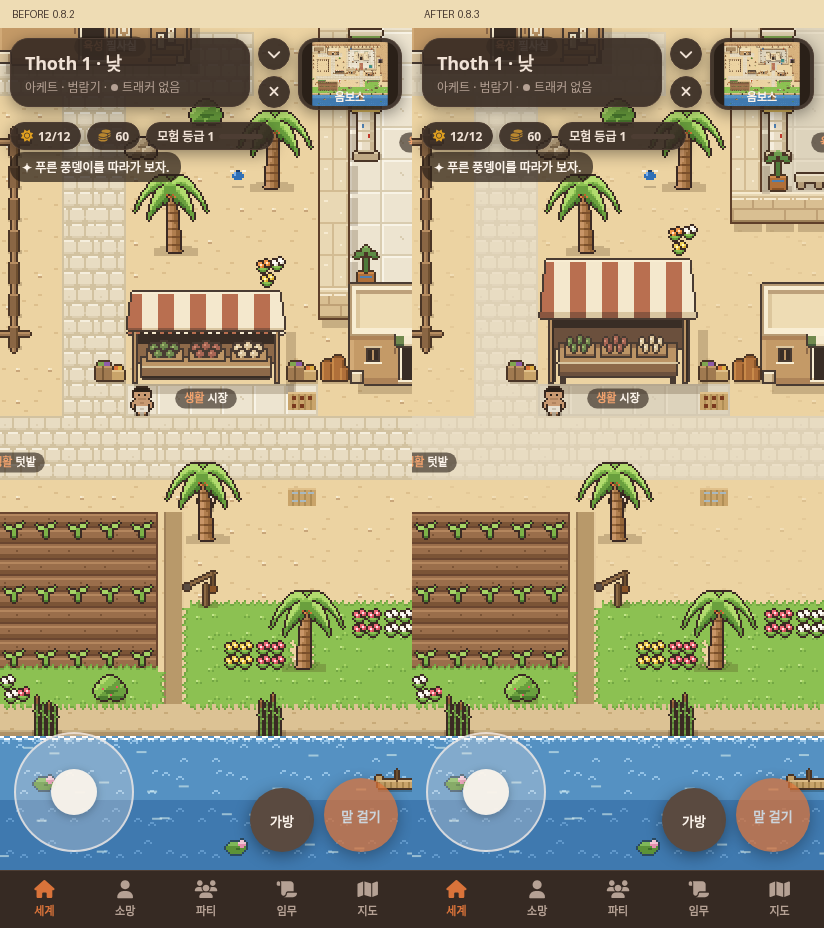
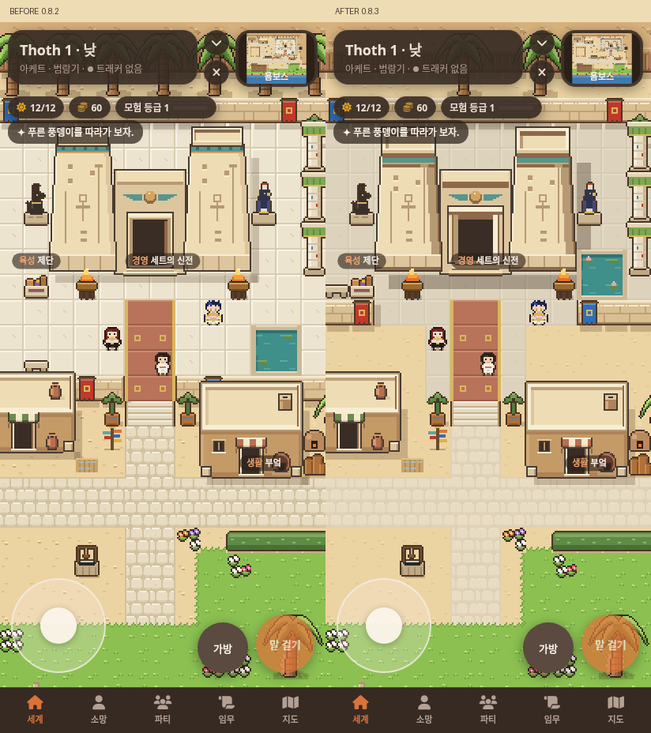

# 옴보스 공간과 깊이 · 0.8.3

0.8.2의 팔레트와 평지붕은 살리고 시장의 앞뒤 관계와 신전 주변 공간을 고쳤어.
왼쪽은 수정 전, 오른쪽은 수정 후야. 실제 SillyTavern에서 같은 412×900 화면과 카메라 위치로 촬영했고 캐릭터와 UI를 포함했어.
말풍선이 건물을 가리지 않도록 시장은 14,20, 신전은 26,13에서 촬영했어.
수정 전은 7cf907a의 원본 타일·지도·paint.js를 브라우저 요청에 제공해 같은 실제 SillyTavern에서 재현했어.

## 시장



천막 윗면은 26픽셀, 앞에 접힌 천은 3픽셀로 나눴어. 상품대를 더 안쪽에 두고
천막 아래 그늘과 빈 공간을 넓혔어. 상품대의 밝은 윗면, 어두운 앞판과 바닥까지 내려오는 기둥이 구분돼.
그림은 82×64픽셀이 됐고 바닥 점유 영역은 기존 5×2타일이야.

## 신전 주변



마당 좌우 아래 부분을 줄여 앞집 지붕 뒤에 약 1.5~2타일의 모래 여백을 만들었어.
가운데 진입로, 계단, 집과 부엌의 위치, 큰길은 유지했어.
마당 안 연못·의자·화분·걸개를 새 경계에 맞춰 옮겼어.
탑 꼭대기의 넓은 윗면, 처마 아래 그늘, 오른쪽 측면, 깊은 문틀과 계단 앞면을 강화했어.
큰 건물의 지면 그림자도 아래와 오른쪽으로 넓혔어.

북쪽 야자수 줄은 여섯 그루로 줄이고 두 그루씩 모인 곳과 한 그루만 있는 곳, 빈 구간을 섞었어.
잎 그림은 바꾸지 않았어. 길·마당 타일 줄과 모래 점은 대비를 낮췄고 잔디 경계와 하얀 물결은 유지했어.

[전체 지도 전](consult/ombos-depth/before-map.png) · [전체 지도 후](consult/ombos-depth/after-map.png) · [신전 야간](consult/ombos-depth/after-temple-night.png)

전체 지도 이미지는 같은 게임 Renderer로 그린 검토용 화면이고, 위 전후 이미지는 실제 모바일 UI 캡처야.

## 검증

[브라우저 검사 결과](consult/ombos-depth/verification.json)의 10개 항목이 통과했어.
키보드·터치 이동, 벽 충돌, 장소와 NPC 상호작용, 지붕 뒤 가림, 정비 후 지도 변화,
야간 발견, 창 접기와 복구 이벤트, 이동 중 아트 재요청 여부를 검사했어. 페이지 오류는 0개야.

배치 변경 중 제단 접근이 막히는 문제가 검사에서 발견됐고, 마당 입구 폭을 조정해 해결했어.
정비 전후 모두 장소 9개, NPC 3명, 모험 기준점 14개에 접근할 수 있어.
NPC 발밑과 새 담장이 겹치지 않는 검사도 추가했어.
건물 충돌 크기, 장소·NPC·모험 지점의 좌표, 정비 오버레이는 기존 값과 동일해.
담장 타일과 옮긴 소품의 충돌은 기존 GameMap 계산에 자동으로 반영돼.

`buildings.py --check`와 `tiles.py` 전체 재생성도 배포 데이터와 일치해.
집·필사실·부엌·두아트 문, 야자수와 소품 그림, 계절 팔레트는 0.8.2와 동일해.
이번 땅 변화는 공유 색상 중 모래·길·신전 바닥의 명암만 조정한 것이야.

```sh
python3 tools/art/buildings.py --check data/tiles.json
node tools/art/verify-browser.cjs /tmp/ombos-depth-review
node tools/art/capture-browser.cjs after /tmp/ombos-depth-review
```

앞선 [제작·실행 안내](OMBOS-BUILDINGS.md)와 같은 전용 SillyTavern 테스트 환경을 사용해.
브라우저 이벤트로 탭 복귀와 컨텍스트 복구를 검사했으며 실제 안드로이드 메모리 압박 검사는 하지 않았어.
