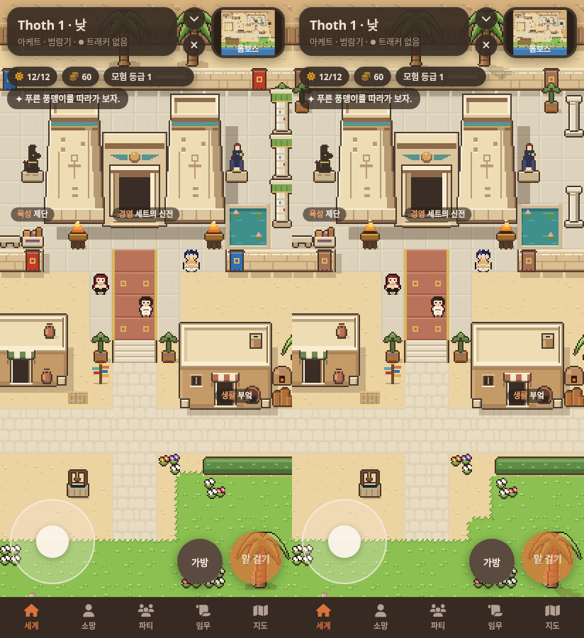
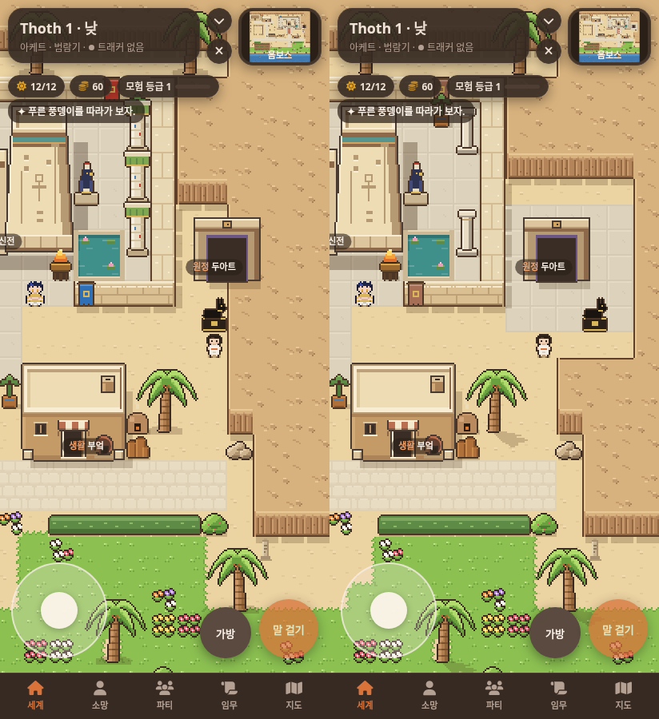
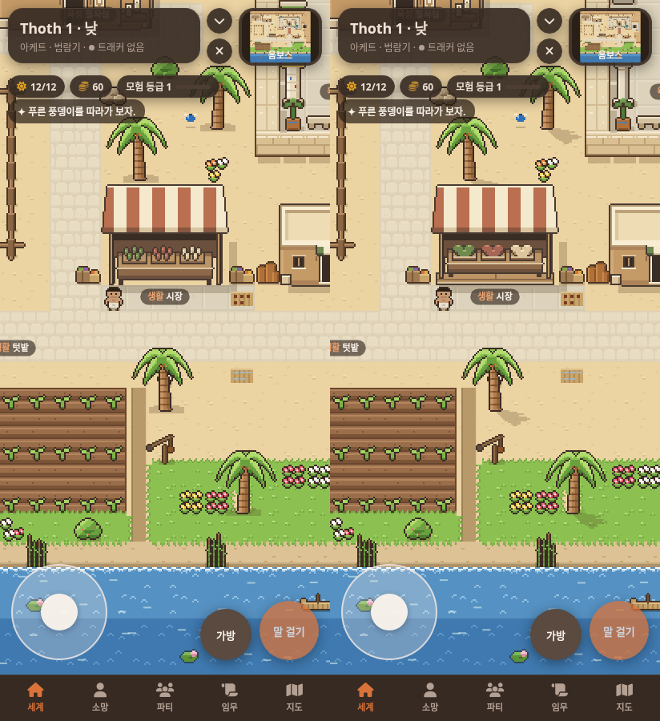
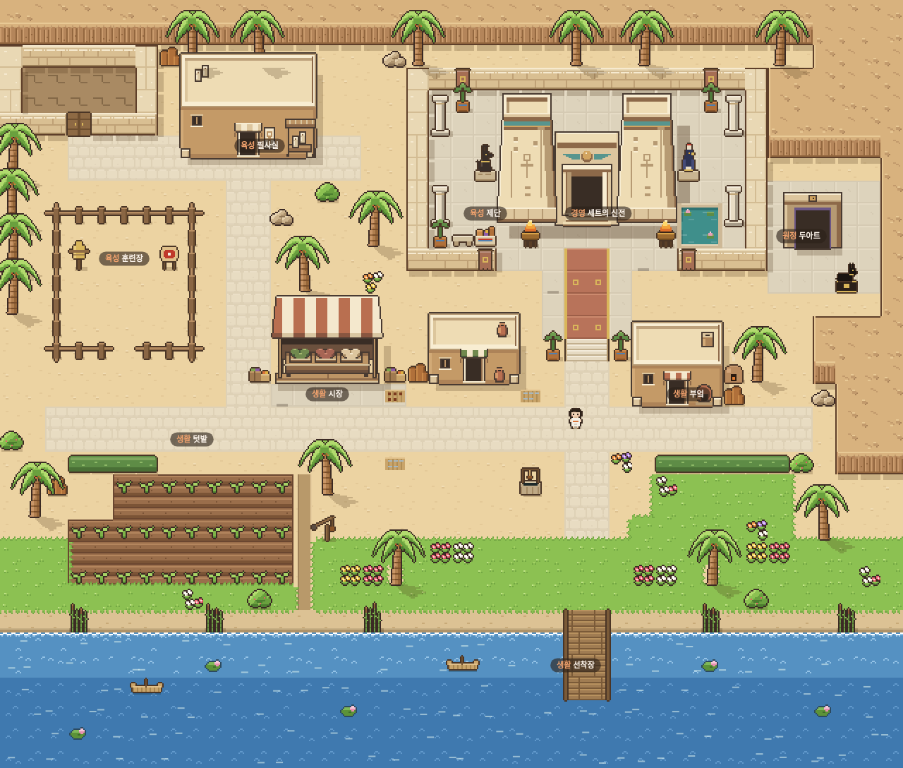

# 옴보스 기둥과 입구 · 0.8.4

0.8.3에서 좋아진 건물 형태, 신전 앞 여백, 시장 그늘은 유지했어.
아래 이미지는 실제 SillyTavern의 412×900 낮 화면이야. 왼쪽은 0.8.3, 오른쪽은 0.8.4이고 같은 위치에서 촬영했어.

## 신전 기둥



기둥은 여섯 개에서 네 개로 줄이고 양쪽 두 개 사이에 바닥을 드러냈어.
넓은 초록 머리, 반복 띠와 빨강·파랑 점을 없애고 가는 크림색 몸통과 갈색이 섞인 회색 그늘, 얇은 황토색 띠로 바꿨어.
뒤 화분이 기둥 머리처럼 겹치지 않도록 옆으로 옮겼고 걸개는 차분한 적갈색으로 맞췄어.
신전의 좁은 청록색 띠와 날개, 집 차양, 식물의 초록은 유지했어.

## 두아트 입구



문이 걸쳐 있던 바위 지형을 실제 지도 데이터에서 정리하고 5×5타일 석재 바닥과 위아래 모래 여백을 만들었어.
문 그림과 위치는 그대로 두고 자칼 상을 정면에서 오른쪽 아래로 옮겼어.
문과 조각상 모두 같은 바닥에 놓이며 조각상과 오른쪽 지형 경계 사이에는 한 칸이 비어 있어.
출입 통로와 기존 상호작용 위치를 유지했어. 그리기 순서를 바꿔 경계선을 가린 것은 아니야.

## 시장과 작은 변화



천막 크기는 그대로야. 상품대 윗면과 앞판을 나누고 기둥 밑동과 상품대 발이 함께 놓이는 짧은 나무 발판을 추가했어.
상품은 세 바구니의 넓은 덩어리로 정리했어.
야자수 잎 그림을 보존하면서 그림자만 밑동에서 오른쪽 아래로 이어지는 불규칙한 덩어리로 바꿨어.
신전 그림자도 공통 갈색 그림자의 색조를 쓰고 농도만 높였어.
밭 왼쪽에 작은 작업용 빈자리, 잔디 가장자리에 모래 파임을 만들었어. 바닥 무늬 밀도는 늘리지 않았어.

## 전체 지도



[수정 전 전체 지도](consult/ombos-details/before-map.png)

전체 지도는 실제 게임 Renderer로 그린 검토용 화면이야. 위의 모바일 이미지는 캐릭터와 UI가 포함된 실제 브라우저 캡처야.

## 검증

[브라우저 검사 11개 통과, 페이지 오류 0개](consult/ombos-details/verification.json).
두아트의 낮 상호작용, 문 충돌, 조각상 충돌, 발밑 석재와 옆 여백, 정면 통로를 추가로 확인했어.
정비 전후 장소 9개, NPC 3명, 모험 기준점 14개에 모두 접근할 수 있어.
키보드와 터치 이동, 장소와 NPC 카드, 정비 오버레이와 배, 밤 발견, 지붕 뒤 가림,
게임 접기와 복구 이벤트, 이동 중 아트 재요청 검사도 통과했어.

건물 충돌 크기와 위치, 장소·NPC·모험 기준점 좌표, 정비 오버레이는 0.8.3과 동일해.
문과 조각상 주변의 지형·장애물 변경은 기존 GameMap 충돌 계산에 반영돼.
`buildings.py --check`와 `tiles.py` 전체 재생성이 배포 데이터와 일치해.
타일 데이터에서는 시장 그림만 변경됐고 다른 건물·야자수·잔디·물결 그림과 계절 팔레트는 그대로야.

```sh
python3 tools/art/buildings.py --check data/tiles.json
node tools/art/verify-browser.cjs /tmp/ombos-details-review
node tools/art/capture-browser.cjs after /tmp/ombos-details-review
```

[준비된 SillyTavern 실행 안내](OMBOS-BUILDINGS.md)를 사용했어.
모바일 크기 Chromium과 터치 입력으로 검증했으며 실제 휴대전화 하드웨어 검사는 하지 않았어.
