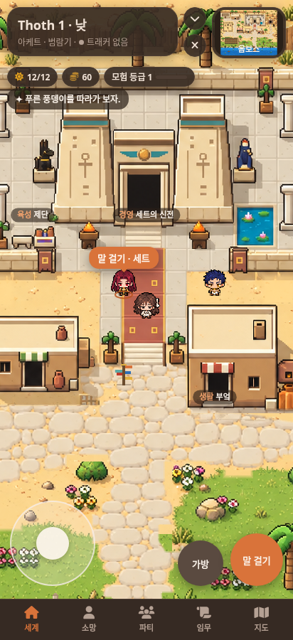
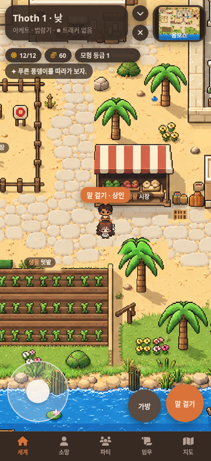

# 초미니 스프라이트 등록 · 0.8.14

선택한 초미니4번에 맞춰 세트·소망·호루스와 상인의 앞·뒤·좌·우 모습을 게임에 등록했다. 승인된 정면 시안은 별도로 보존하고, 이동에 필요한 방향과 상인은 파생 시트로 준비했다.

## 에셋과 표시

- [런타임 PNG](../data/art/characters/pocket-chibi.png): 256×256 투명 이미지, 64×64 셀16개.
- 행은 세트·소망·호루스·상인, 열은 앞·왼쪽·오른쪽·뒤 순서다.
- 게임에서 셀 크기는20×20 논리px. 발 좌표와 충돌 크기는 기존대로 유지한다.
- 호루스는 날개 없이, 정면 화면 오른쪽에만 눈 문양을 가진다. 좌우 이미지를 따로 사용한다.
- 방향별 정지 이미지와 기존 이동bob을 사용한다. 별도의 다리 교대 애니메이션은 이번 작업 범위에 없다.
- 정밀 미니는 [보존 폴더](art/sprites/approved)에 남겼다. 대화/파티 화면에 표시하는 기능은 아직 구현하지 않았다.
- [방향 원본](art/sprites/pocket-directions-source.png), [런타임 확대판](consult/pocket-chibi/board.png), [전체 맵](consult/pocket-chibi/map.png).

## 검증

실제 SillyTavern의 모바일뷰에서16방향 로드·투명도·발 정렬·호루스 비대칭·상인 상호작용을 확인했다. PNG 프레임 범위 오류도 감지한다. [결과 JSON](consult/pocket-chibi/verification.json).

기존 전체맵 검사12개도 통과했다. 낮/밤 각각1,462,272픽셀 비교에서 배경 불일치0, 이동·터치·상호작용·두아트·가림·정비·접기와 복귀가 정상이다. [회귀 결과](consult/pocket-chibi/map-regression.json).

다음 작업자는 [최신 인수인계](SESSION-HANDOFF.md)를 먼저 읽는다. 원본 선택 과정, 외형 수정사항, 에셋과 코드 위치, 재현 명령, 미구현 범위를 담았다.
