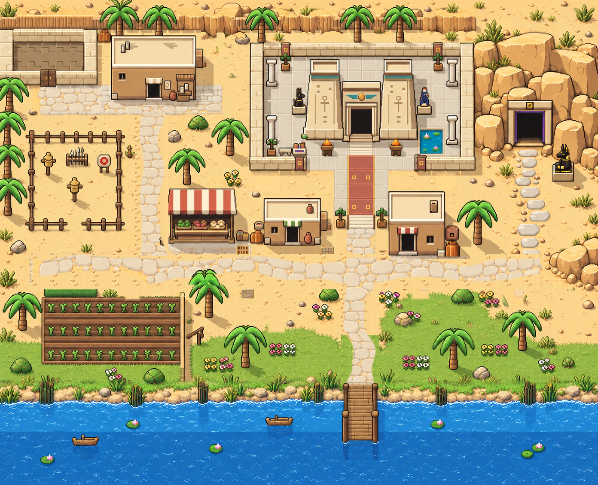

# 1번 수정본 — 길 전체 윤곽 수정

기존 1번 이미지의 길 영역을 직접 편집한 비교용 시안입니다. 게임에는 적용하지 않았습니다.

시장 옆 세로길, 마을 가로길, 선착장 접근로의 방향과 폭을 조정했습니다. 교차로는 폭을 넓히고 일부 구간은 좁혀, 일정한 폭의 직사각형 띠가 이어지는 모습을 줄였습니다.

[수정 전 1번](../option2-revisions/option2-revision-1.png)
